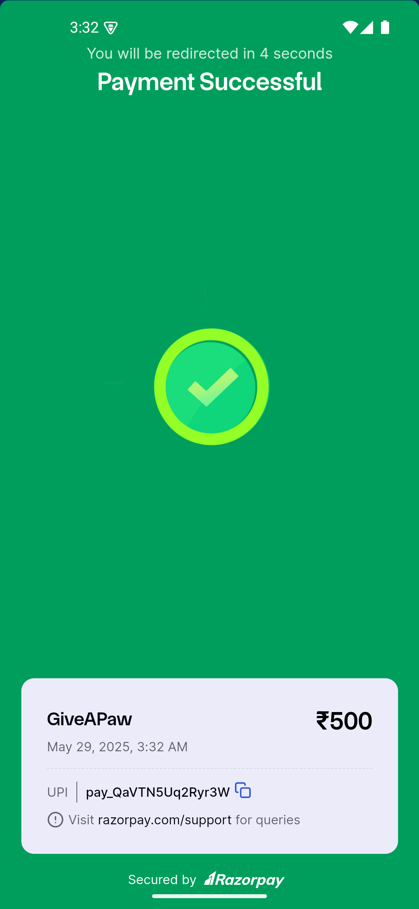

# 🐾 GiveAPaw

A **dog donation app** built with Flutter that allows users to make quick, secure donations to support dogs in need. Perfect for animal lovers and anyone who wants to contribute with ease.

## ✨ Features

- **Easy Donations** – Seamlessly donate using Razorpay integration  
- **Secure Payments** – Real payments processed safely  
- **User-friendly UI** – Clean, friendly interface with a cute dog theme      

## 📸 Screenshots

<p align="center">
    
    
    
    
    
    
    
    
</p>

## 🧩 Dependencies

This project uses the following Flutter packages:

- [`razorpay_flutter`](https://pub.dev/packages/razorpay_flutter) — For integrating Razorpay payment gateway  
- [`fluttertoast`](https://pub.dev/packages/fluttertoast) — To show toast messages for payment success/failure  

## Installation

1. Clone the repository:

```bash
git clone https://github.com/your-username/giveapaw.git
```

2. Navigate to the project directory:

```bash
cd giveapaw
```

3. Install dependencies:
```bash
flutter pub get
```

4. Run the app:
```bash
flutter run
```